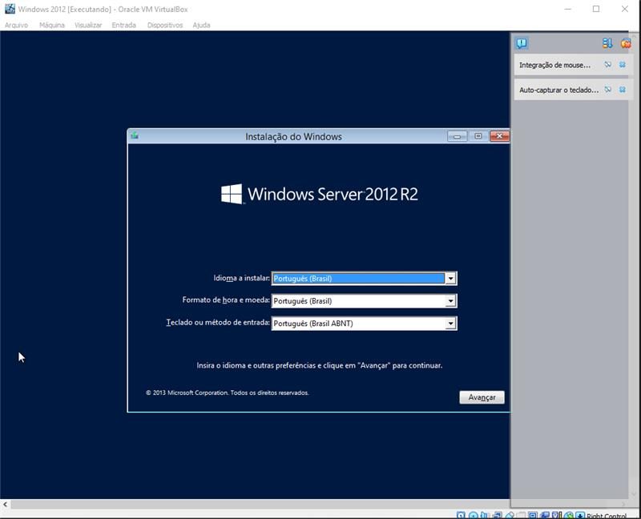
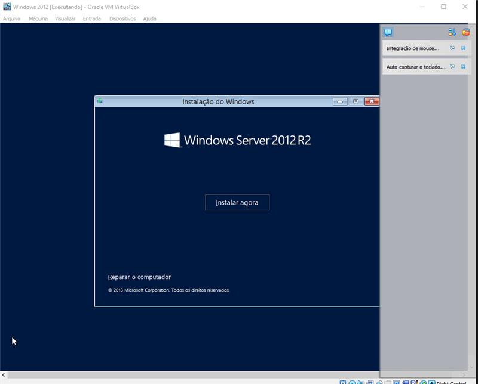
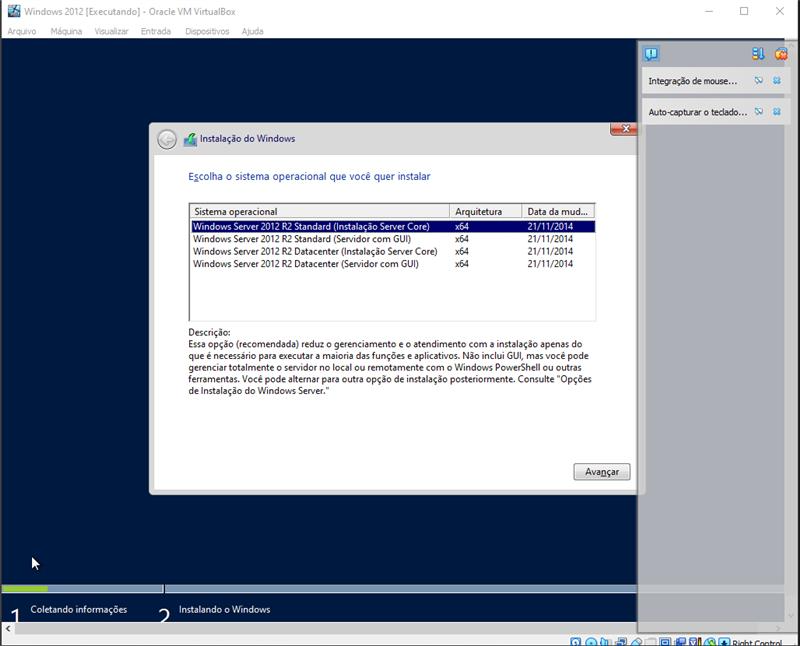
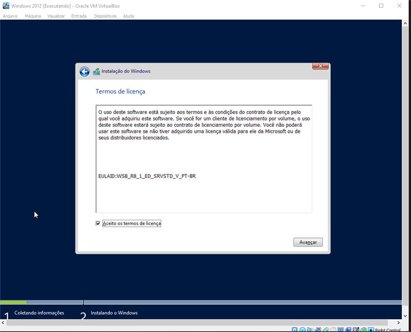
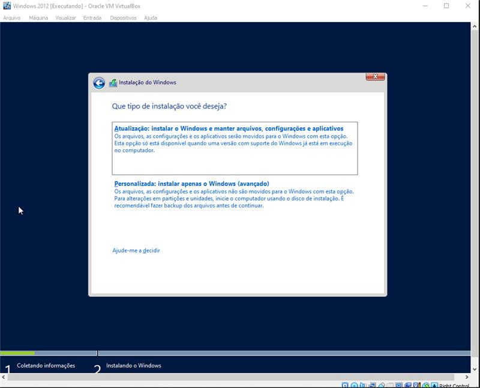
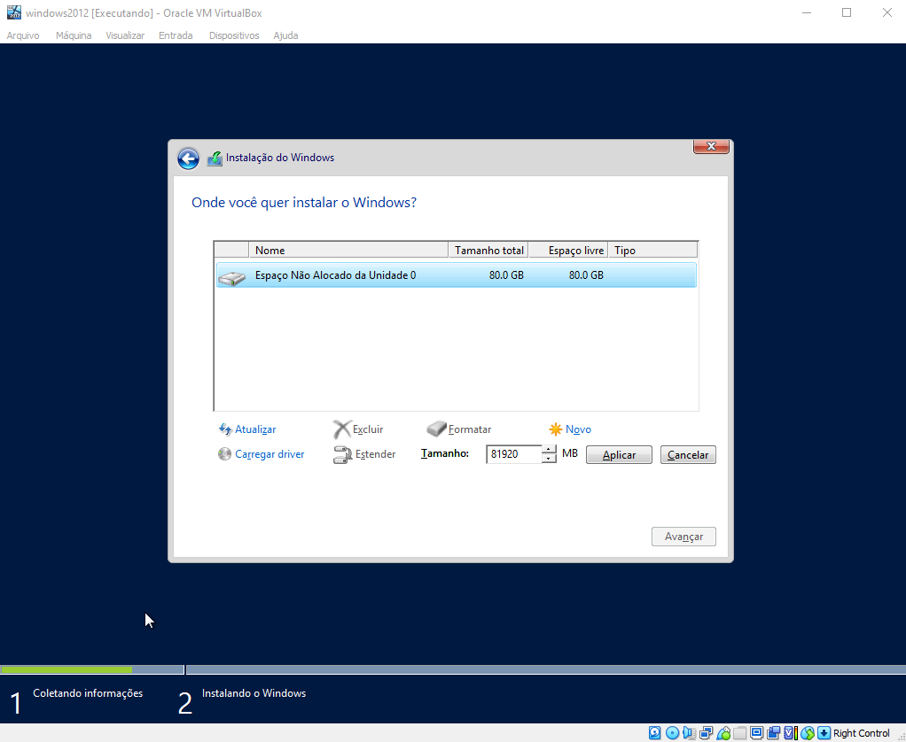
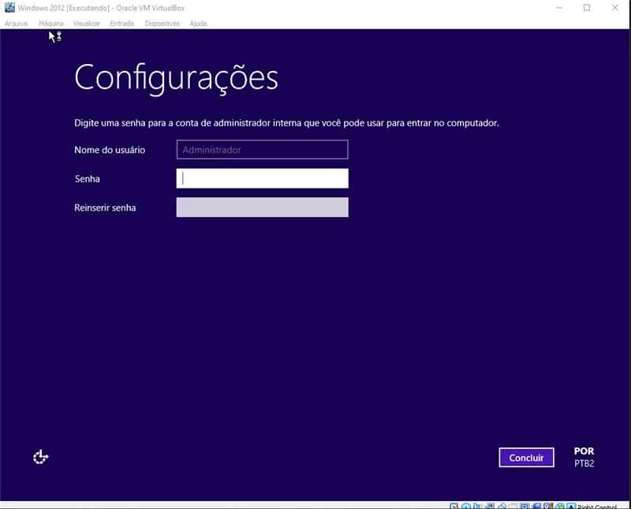
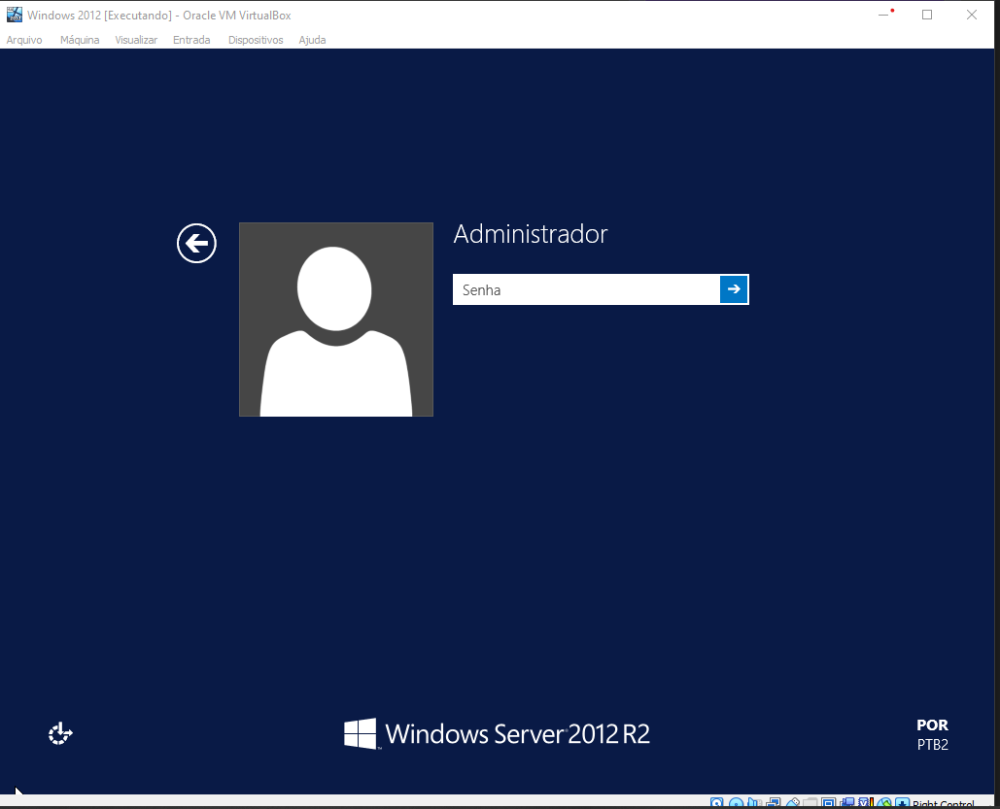
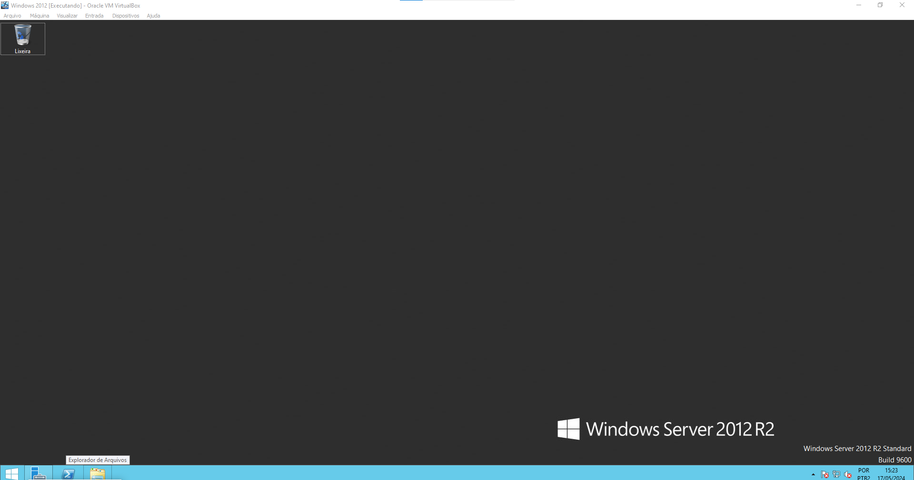

# Como Instalar o Windows Server 2012 no seu PC
#### PASSO 1:
* Logo após de você iniciar o windows , ele vai te mostrar a seguinte tela:

    
* Nessa tela , você vai adicionar seu **idioma , a hora , moeda e o método de entrada** de sua preferência , após concluir esses passos clique em 'finalizar' no canto inferior direito.

### PASSO 2:

* Para passar por essa tela , basta clicar no botão **instalar agora** no meio da tela.

### PASSO 3:

* Agora nessa tela você vai selecionar o sistema operacional no qual você quer instalar, **é recomendado instalar a segunda opção pois ela tem interface gráfica** , mas para melhores informações , na parte de baixo das opções aparece o que cada sistema operacional faz. **Após selecionar, clique em finalizar.**

### PASSO 4:

 * Aceite os termos de licença e avance.

 ### PASSO 5:
 

 * Aqui você vai selecionar a segunda opção que está escrita ***personalizada***.

 ### PASSO 6:
 * Clique **☀️novo** para configurar a memória que seu windows vai utilizar.

 * Em tamanho , **voce vai colocar 61920MB** , após alterar clique em **aplicar** e depois avance.
 

 #### seu computador irá reiniciar , aguarde para passar para o próximo passo.

 ### PASSO 7:
 * Após reiniciar , o windows vai te pedir para você colocar uma senha para sua conta de administrador. Quando concluir esses passos clique em **concluir**.
 
 

 ### PASSO 8:
*  Para você conseguir prosseguir , **clique no host (cntrl direito do teclado) + delete** , e digite sua senha.
 
 
 
 

 ### Pronto!!!

 

 ## você instalou o Windows Server 2012 👍🏻 , espero ter ajudado!😀